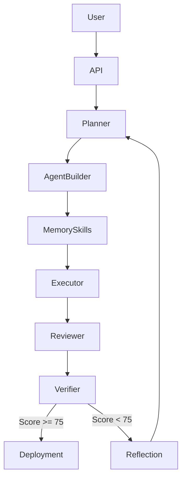

# Architektur - LangGraph Builder Team

## Systemueberblick

Das LangGraph Builder Team ist ein meta-agentisches System zum Planen, Bauen,
Testen, Reviewen und Deployen von LangGraph-basierten Agents, Workflows, Skills
und Projekten.

Die Architektur trennt die offiziellen Produkte bewusst nach ihrer vorgesehenen
Rolle:

- **LangChain**: Modell-, Tool- und Runnable-Schicht im Anwendungscode.
- **LangGraph**: Agent-Orchestrierung, StateGraph, Checkpointing und optionaler
  LangGraph Server ueber `langgraph.json`.
- **LangSmith**: Tracing, Evaluation und Observability ueber offizielle
  Environment-Variablen und LangSmith-Projekt.
- **Builder Team App**: Operator-UI, Projektverwaltung, Chat-History,
  Build-History und Integrations-API.

Es werden keine LangChain-/LangGraph-/LangSmith-Produkte nachgebaut. Die App
ergaenzt die Produktlinie als Projekt- und Operator-Oberflaeche.

## Agenten-Struktur

| Agent | Verantwortung | Subgraph? |
| --- | --- | --- |
| Orchestrator | Koordination & Routing | - |
| Planner & Architect | Detaillierter Plan + System Design | Nein |
| Agent Builder | LangGraph Code Generierung | Nein |
| Memory, Skills & Tools | Memory- & Skill-Architektur | Nein |
| Executor & Sandbox Tester | Sichere Code-Ausfuehrung & Tests | Ja, geplant |
| Reviewer & Critic | Code- & Architektur-Review | Nein |
| Verifier & Evaluator | Finales Quality Gate | Nein |
| Git, Docs & Deployment | Dokumentation + Deployment Artefakte | Nein |

## State Management

- **Primary Checkpointer**: Postgres
- **Vector Store**: Qdrant mit Namespace pro `project_id`
- **State Contract**: `BuilderState` in `src/langgraph_builder_team/models.py`
- **Wichtige State-Felder**: `plan`, `generated_artifacts`, `test_results`,
  `review_feedback`, `quality_score`, `verification_result`

## Datenfluss

## Runtime-Schichten

| Schicht | Offizielles Produkt | Umsetzung im Repo |
| --- | --- | --- |
| LLM/Tools/Runnables | LangChain | `langchain_adapter.py`, LLM Adapter, MCP Tool Adapter |
| Agent Graph | LangGraph | `graph.py`, `StateGraph`, `PostgresSaver`, `langgraph.json` |
| Agent Server | LangGraph Platform/Server | separater Compose-Service `langgraph-server` auf Port `2024` |
| Tracing/Evals | LangSmith | `LANGSMITH_*` / `LANGCHAIN_TRACING_V2` |
| Operator UI/API | Eigene App | FastAPI UI/API auf Port `8000` |

## Persistence

Das Compose-Setup liefert Postgres und Qdrant mit. Postgres wird fuer
Build-/Chat-History und den LangGraph Postgres Checkpointer genutzt. Qdrant wird
fuer Projekt-Memory und semantische Suche genutzt.

## Subdomain-Trennung

Production-Deployment trennt die Oberflaechen ueber Subdomains:

| Subdomain | Ziel | Oeffentlich? |
| --- | --- | --- |
| `builder.example.com` | Builder Team UI | Ja, mit Auth |
| `api.example.com` | Builder Team FastAPI/API | Ja, mit Auth/API-Schutz |
| `graph.example.com` | Offizieller LangGraph Server aus `langgraph.json` | Optional, nur wenn gebraucht |
| `smith.langchain.com` | Offizielle LangSmith UI | Extern/SaaS |
| `postgres` | Checkpointer + History DB | Nein, intern |
| `qdrant` | Vector Memory | Nein, intern |

## API

- `GET /`: minimalistische Web-UI
- `GET /health`: Healthcheck fuer Docker, Reverse Proxy und Monitoring
- `POST /build`: startet den Builder-Workflow und gibt `BuildResponse` zurueck

## Design-Entscheidungen

Siehe [docs/adr](./adr).

Die wichtigsten bisherigen Entscheidungen:

- LangChain bleibt Code-/Tool-Schicht und wird nicht als eigener Service
  behandelt.
- LangGraph laeuft im Code als `StateGraph` und optional separat als
  LangGraph Server.
- LangSmith wird nicht selbst gehostet oder imitiert, sondern ueber offizielle
  Tracing-Konfiguration angebunden.
- Docker Compose bleibt der Standardpfad fuer VPS-Deployment.
- Postgres und Qdrant sind Infrastruktur-Services und bleiben intern.

## Risiken & Mitigation

- Lange Build-Zeiten: spaeter Async Subgraphs und Human Gates einsetzen.
- Halluzinierter Code: strukturierte Outputs, Sandbox Tester und Verifier Loop.
- Kosten: Token Tracking und Model-Routing pro Agent.
- Unsichere Code-Ausfuehrung: Sandbox mit Allow-Lists und isolierten Volumes.

## Skalierbarkeit

Das System ist so designed, dass es spaeter selbst neue spezialisierte
Builder-Teams generieren kann. Dafuer bleiben Agenten, Skills, Memory und
Deployment-Artefakte klar getrennt und versionierbar.
