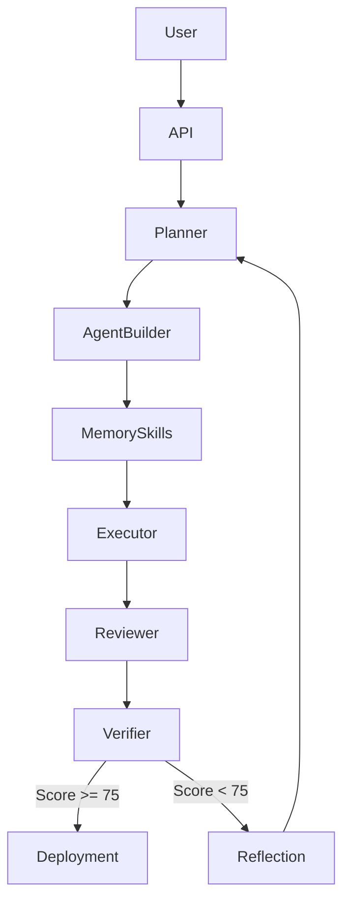

# Architektur - LangGraph Builder Team

## Systemueberblick

Das LangGraph Builder Team ist ein meta-agentisches System zum Planen, Bauen,
Testen, Reviewen und Deployen von LangGraph-basierten Agents, Workflows, Skills
und Projekten.

Der aktuelle MVP nutzt einen deterministischen `StateGraph`, damit lokale Tests,
Docker-Builds und VPS-Deployments ohne API-Key reproduzierbar funktionieren. Die
LLM-Integration ist als naechster Ausbaupunkt pro Agent-Node vorgesehen.

## Agenten-Struktur

| Agent | Verantwortung | Subgraph? |
| --- | --- | --- |
| Orchestrator | Koordination & Routing | - |
| Planner & Architect | Detaillierter Plan + System Design | Nein |
| Agent Builder | LangGraph Code Generierung | Nein |
| Memory, Skills & Tools | Memory- & Skill-Architektur | Nein |
| Executor & Sandbox Tester | Sichere Code-Ausfuehrung & Tests | Ja, geplant |
| Reviewer & Critic | Code- & Architektur-Review | Nein |
| Verifier & Evaluator | Finales Quality Gate | Nein |
| Git, Docs & Deployment | Dokumentation + Deployment Artefakte | Nein |

## State Management

- **Primary Checkpointer**: Postgres
- **Vector Store**: Qdrant mit Namespace pro `project_id`
- **State Contract**: `BuilderState` in `src/langgraph_builder_team/models.py`
- **Wichtige State-Felder**: `plan`, `generated_artifacts`, `test_results`,
  `review_feedback`, `quality_score`, `verification_result`

## Datenfluss

## Runtime

Das System nutzt `langgraph.graph.StateGraph` und typisierte Pydantic-Modelle als
Vertrag zwischen den Nodes. Jeder Node nimmt einen `BuilderState` entgegen und
gibt denselben State mit neuen Artefakten, Entscheidungen oder Ergebnissen
zurueck.

## Persistence

Das Compose-Setup liefert Postgres und Qdrant mit. Der aktuelle MVP startet diese
Services bereits produktionsnah; die konkrete LangGraph-Checkpointer- und
Vector-Store-Anbindung ist der naechste Implementierungsschritt.

## API

- `GET /`: minimalistische Web-UI
- `GET /health`: Healthcheck fuer Docker, Reverse Proxy und Monitoring
- `POST /build`: startet den Builder-Workflow und gibt `BuildResponse` zurueck

## Design-Entscheidungen

Siehe [docs/adr](./adr).

Die wichtigsten bisherigen Entscheidungen:

- Deterministische Nodes vor echter LLM-Ausfuehrung, damit Tests und Deployment
  stabil sind.
- Docker Compose als Standardpfad fuer VPS-Deployment.
- Postgres und Qdrant sind von Anfang an Teil der Infrastruktur, auch wenn die
  tiefe Persistenz-Integration inkrementell folgt.
- Hermes-Kompatibilitaet wird ueber Skill-Dateien und `hermes_profile.yaml`
  Artefakte vorbereitet.

## Risiken & Mitigation

- Lange Build-Zeiten: spaeter Async Subgraphs und Human Gates einsetzen.
- Halluzinierter Code: strukturierte Outputs, Sandbox Tester und Verifier Loop.
- Kosten: Token Tracking und Model-Routing pro Agent.
- Unsichere Code-Ausfuehrung: Sandbox mit Allow-Lists und isolierten Volumes.

## Skalierbarkeit

Das System ist so designed, dass es spaeter selbst neue spezialisierte
Builder-Teams generieren kann. Dafuer bleiben Agenten, Skills, Memory und
Deployment-Artefakte klar getrennt und versionierbar.
