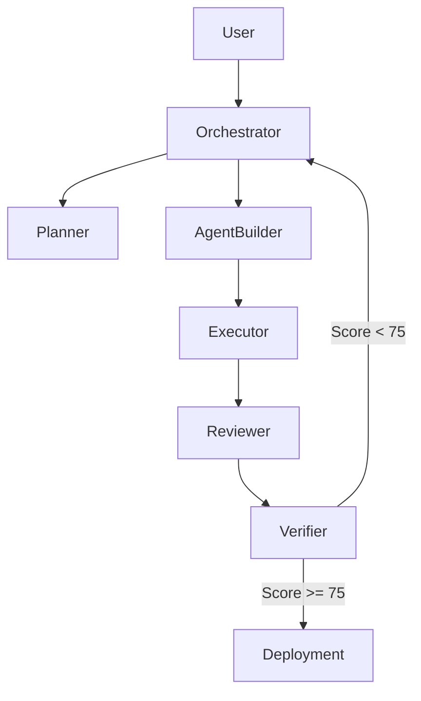

# Architektur - {{ project_name }}

## Systemueberblick

{{ high_level_description }}

## Agenten-Struktur

| Agent | Verantwortung | Subgraph? |
| --- | --- | --- |
| Orchestrator | Koordination & Routing | - |
| Planner & Architect | Detaillierter Plan + System Design | Nein |
| Agent Builder | LangGraph Code Generierung | Nein |
| Memory, Skills & Tools | Memory- & Skill-Architektur | Nein |
| Executor & Sandbox Tester | Sichere Code-Ausfuehrung & Tests | Ja |
| Reviewer & Critic | Code- & Architektur-Review | Nein |
| Verifier & Evaluator | Finales Quality Gate | Nein |
| Git, Docs & Deployment | Dokumentation + Deployment Artefakte | Nein |

## State Management

- **Primary Checkpointer**: Postgres
- **Vector Store**: Qdrant (Namespace = `{{ project_id }}`)
- **Wichtige State-Felder**: `plan`, `generated_artifacts`, `quality_score`,
  `verification_result`

## Datenfluss

## Design-Entscheidungen

Siehe `docs/adr/`.

## Risiken & Mitigation

- Lange Build-Zeiten: Async Subgraphs + Human Gates
- Halluzinierter Code: Starker Executor + Verifier Loop
- Kosten: Token Tracking + Model-Routing pro Agent

## Skalierbarkeit

Das System ist so designed, dass es spaeter selbst neue spezialisierte
Builder-Teams generieren kann.
